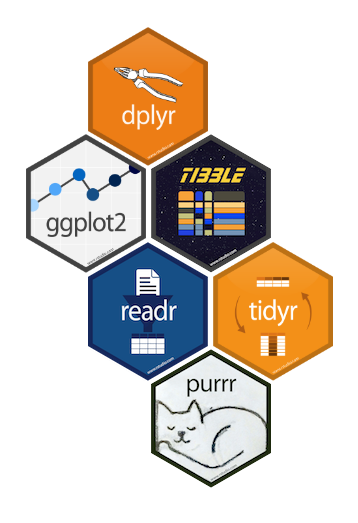
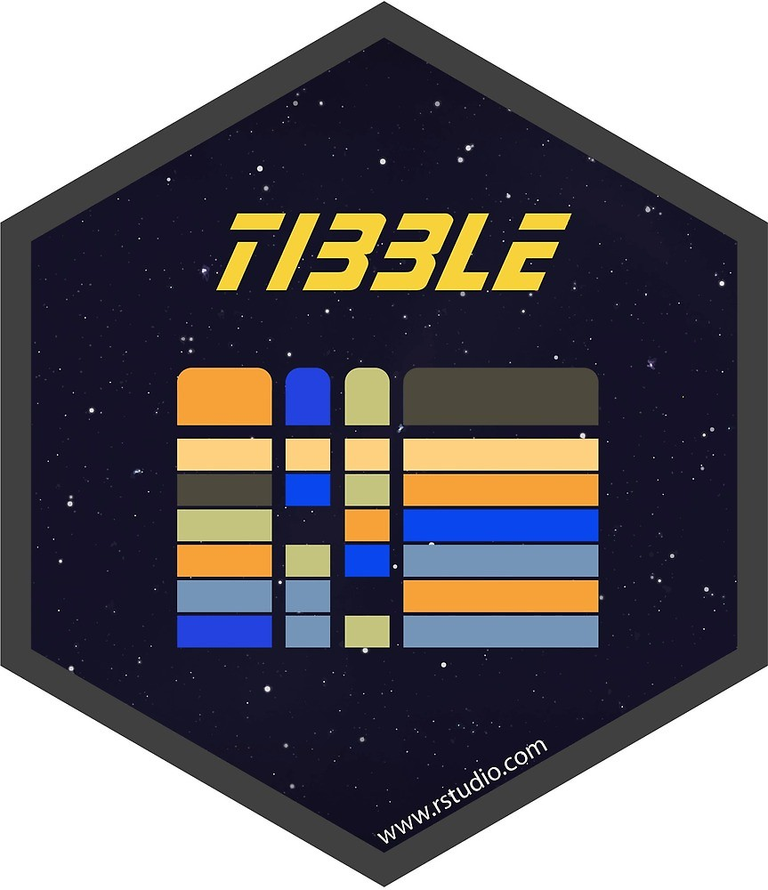

***

```{r setup, include = FALSE}
knitr::opts_chunk$set(fig.align = "center")
```


## Data Science Workflow

 Data science is an exciting discipline that allows you to turn raw data into 
understanding, insight, and knowledge.

1. Import
1. Wrangle (tidy & transform)
1. Visualize
1. Model
1. Communicate


## An Introduction to `tidyverse` 


The `tidyverse` is an opinionated collection of R packages designed for data 
science. All packages share an underlying design philosophy, grammar, and data 
structures. [^1] 

[^1]: [Tidyverse website](https://www.tidyverse.org/)

`tidyverse` includes packages for **importing, wrangling, exploring
and modeling data**.

The system is intended to make data scientists more productive. To use
`tidyverse` do the following:

```{r, eval = FALSE}
# Install the package
install.packages("tidyverse")
# Load it into memory
library("tidyverse")
```

{width=50%}
{width=50%}

## The `tibble` Package

The `tibble` package is part of the core `tidyverse`.


 Tibbles are a modern take on data frames. They keep the features that have 
stood the test of time, and drop the features that used to be convenient 
but are now frustrating.

{width=30%}


`tibbles` are data frames, tweaked to make life a little easier. Unlike
regular `data.frames` they:

- never change the type of the inputs (e.g. do not convert strings to factors!)
- never changes the names of variables
- never creates row.names()
- only recycles inputs of length 1


## Using `tibbles`

To use functions from `tibble` and other `tidyverse` packages:
```{r, warning = FALSE, message = FALSE}
# load it into memory
library(tidyverse)
```

Printing `tibble` is much nicer, and always fits into your window:
```{r}
# e.g. a built-in dataset 'diamonds' is a tibble:
class(diamonds)
head(diamonds)
diamonds
```


**Creating `tibbles`** is similar to `data.frame`s, but no strict rules on column names:

```{r}
tb <- tibble(x = 1:5, y = 1,z = x ^ 2 + y, `:)` =  "smile")
tb
```


**Subsetting `tibbles` is stricter** than subsetting `data.frames`,
and ALWAYS returns objects with expected class: a single
`[` returns a `tibble`, a double`[[` returns a vector.

```{r}
class(diamonds$carat)
class(diamonds[["carat"]])
```

```{r}
class(diamonds[, "carat"])
```


## More on `tibbles`

Convert a regular data frame to tibble:

```{r}
# a regular data frame
head(iris)
```

```{r}
 as_tibble(iris)
```

Convert a tibble to data frame:

```{r}
tb
as.data.frame(tb)
```


Transposed tibbles:

```{r}
tribble(
~x, ~y, ~z, 
#--|--|---- 
"a", 2, 3.6,
"b", 1, 8.5
)
```

By default, tibble prints the first 10 rows and all columns that fit on screen.

````{r}
my_df <- tibble(
  a = lubridate::now() + runif(1e3) * 86400,
  b = lubridate::today() + runif(1e3) * 30,
  c = 1:1e3,
  d = runif(1e3),
  e = sample(letters, 1e3, replace = TRUE)
)
print(my_df,n=12)
```


To change number of rows and columns to display:

```{r}
# install.packages(nycflights13)
library(nycflights13)
  print(flights,n = 10, width = Inf)
```

To change the default print behavior:

##  Subsetting

```{r}
df <- tibble(
  x = runif(5),
  y = rnorm(5)
)
```

```{r}
# Extract by name
df$x
df[["x"]]
```
```{r}
# Extract by position
df[[1]]
```

## An Introduction to Pipe

- Tidyverse functions are at their best when composed together using the pipe operator
- It looks like this: `%>%`. **Shortcut**: use `ctrl + shift + m` in RStudio
- This operator actually comes from the `magrittr` package (automatically included in `dplyr`)
- **Piping** at its most basic level: 

  + Take one return value and automatically feed it in as an input to another function, to form a flow of results


## How to read pipes: single arguments

Passing a single argument through pipes, we interpret something like:

```{r, eval=FALSE}
x %>% f %>% g %>% h
```

as `h(g(f(x)))`

**Key takeaway**: in your mind, when you see `%>%`, read this as **"and then"**

## Simple example

We can write `exp(1)` with pipes as `1 %>% exp`, and `log(exp(1))` as `1 %>% exp %>% log`

```{r}
exp(1)
1 %>% exp
1 %>% exp %>% log
```

## How to read pipes: multiple arguments


Now for multi-arguments functions, we interpret something like:

```{r, eval=FALSE}
x %>% f(y) 
```

as `f(x,y)`

## Simple example

```{r, eval=FALSE}
mtcars %>% head(4) 
```

And what's the "old school" (base R) way?

```{r, eval=FALSE}
head(mtcars, 4)
```

Notice that, with pipes:  

- Your code is more readable (arguably)  
- You can run partial commands more easily

## The dot

The command `x %>% f(y)` can be equivalently written in **dot notation** as:

```{r, eval=FALSE}
x %>% f(., y)
```

What's the advantage of using dots? Sometimes you want to pass in a variable as the *second* or *third* (say, not first) argument to a function, with a pipe. As in:

```{r, eval=FALSE}
x %>% f(y, .)
```

which is equivalent to `f(y,x)`


## More details about `tibble`?

You can read more about other `tibble` features by calling on your R console:

```{r, eval = FALSE}
vignette("tibble")
```

